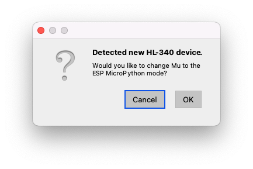
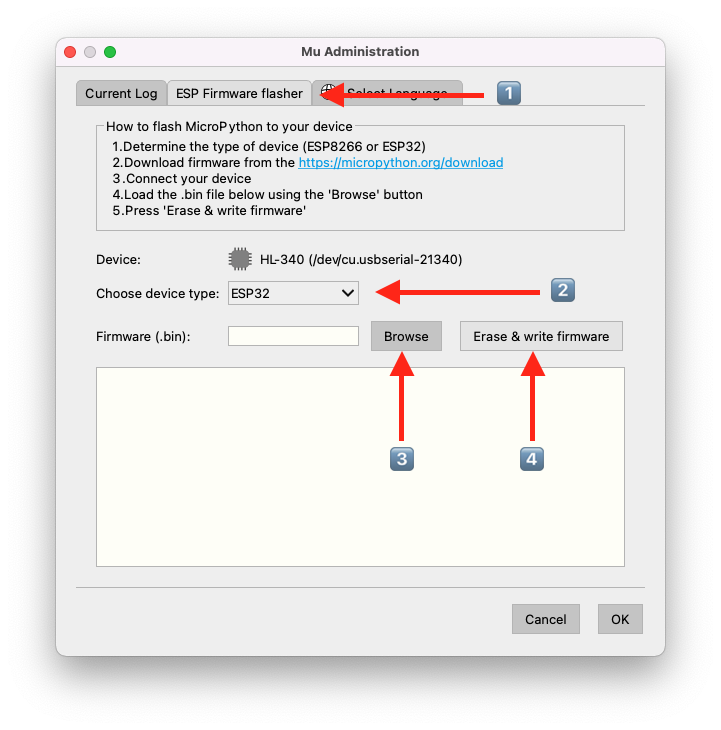

# Flashing
There is 3 methods described here to flash firmware to our cores, all available on Windows, MacOS, and Linux, including ARM versions.

1. _Easy_: Using [__Mu__](#Mu "Goto Mu instructions")
2. _Fast_: Using Espressif's Python based [__esptool__](#esptool "Goto esptool instructions")
3. _Flexible_: Compile and upload the source with [__Arduino__](#Arduino  "Goto Arduino instructions")

Optionally see [more techincal information here](TECHNICAL.md) about how the .bin files are created.

## Mu
Mu[†](#†) is a Python editor usefull with embedded solutions, such as this. Our cores are based on the Espresssif ESP32, and Mu supports programming in MicroPython on the ESP32. Mu also has a firmware flashing tool to flash MicroPython to an ESP32, but we are using this flashing tool to flash our firmware to the same core.

### Instructions
1. Download and install Mu, following the instructions here: https://codewith.mu/en/download
2. Start Mu: It will download some more files, so it can take a bit time first time around.
3. Download the .bin file you want to flash, as instructed in the repository that led you here.
4. Assemble and insert the circuit into a USB port. Click :ok:, if the message below occurs.
5. Check, in the lower right corner, that the circuit is inserted and detected by seeing this  and _not_ this 
6. Click on the gear  to get to the flashing menu
7. 
   1. Choose the second tab `Firmware flasher`
   2. Select `ESP32` in the dropdown menu
   3. Browse to your .bin file
   4. Click on `Erase & write firmware`

> This method is easy, but slow way to flash firmware if you have several cores to flash. Below using [__esptool__](#esptool "Goto esptool instructions") you can flash much faster, but it is more complicated.

## esptool

### Instructions
1. Download and install Mu, following the instructions here: https://www.arduino.cc/en/software

## Arduino

- - - -
#### † 
Mu is the pronounciation of the greek letter μ, which is the SI prefix for micro, here referring to micro controllers.
